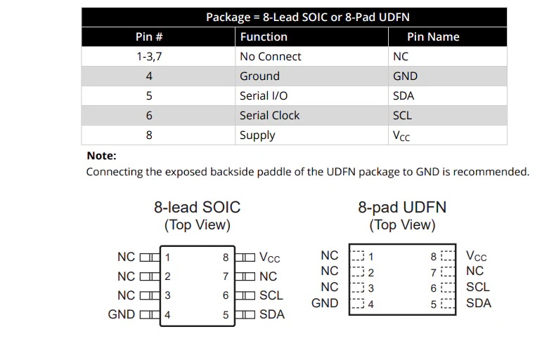
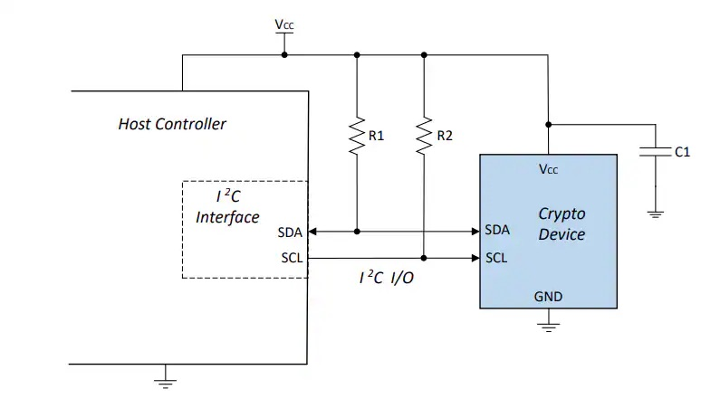

# RNG90 Library

A comprehensive Arduino library for interfacing with the RNG90 hardware random number generator via I2C communication. This library provides secure random number generation capabilities for embedded projects.

## Author
**Alexander Slatina**

## License
MIT License

## Platform Compatibility
- Built for use with Arduino SDK
- **Recommended**: PlatformIO for VS Code
- Compatible with standard Arduino platforms and ATTiny microcontrollers
- Supports Raspberry Pi Pico and other RP2040/RP2350-based boards

## Important Notice

> **⚠️ Hardware Requirement**: This library requires the Microchip RNG90 hardware random number generator IC.

**Source:** https://eu.mouser.com/new/microchip/microchip-rng90-cryptoauthentication/

### RNG90 Pin Configuration



### Example Circuit



## Features

### Core RNG90 Functionality
- **Hardware Random Number Generation**: Generate cryptographically secure 32-byte random data blocks
- **Device Management**: Wake/sleep control for power management
- **Device Information**: Read device revision and serial number
- **Self-Testing**: Built-in hardware self-test capabilities with multiple test modes
- **Error Handling**: Comprehensive status reporting and error detection
- **CRC Validation**: Built-in CRC16 validation for data integrity

### Random String Generation
- **Unbiased Character Selection**: Uses rejection sampling to ensure uniform distribution
- **Customizable Character Sets**: Generate strings with custom character sets
- **Efficient Memory Usage**: Reuses random data blocks to minimize I2C transactions
- **Default Character Set**: Includes alphanumeric and special characters

## Hardware Requirements

- **RNG90 Hardware Random Number Generator**
- **I2C Connection**: 
  - Default I2C address: `0x40`
  - Supports up to 400kHz I2C clock speed
- **Power**: Compatible with 3.3V and 5V systems

## Installation

### PlatformIO (Recommended)
1. Copy the library files to your project's `lib/rng90/` directory
2. Include the library in your main code:
```cpp
#include "RNG90.h"
#include "RNGString.h"  // Optional: for string generation
```

## API Reference

### RNG90 Class

#### Constructor
```cpp
RNG90(TwoWire &wirePort = Wire)
```
Initialize the RNG90 with a specific I2C interface (defaults to Wire).

#### Basic Methods
```cpp
void begin(uint8_t sdaPin = 255, uint8_t sclPin = 255)
```
Initialize I2C communication. On supported platforms, you can specify custom SDA/SCL pins.

```cpp
Status wake()
```
Wake the RNG90 device from sleep mode. Returns `WAKE_SUCCESS` on success.

```cpp
Status sleep()
```
Put the RNG90 device into sleep mode for power saving.

#### Random Number Generation
```cpp
Status random(uint8_t buf[32])
```
Generate 32 bytes of cryptographically secure random data.

#### Device Information
```cpp
Status info(uint8_t rev[4])
```
Read the device revision information (4 bytes).

```cpp
Status readSerial(uint8_t serial[16])
```
Read the device serial number (16 bytes).

#### Self-Testing
```cpp
Status selfTest(uint8_t mode, uint8_t &result)
```
Perform device self-test with specified mode:
- `0x00`, `0x01`, `0x20`, `0x21`: Different test modes

#### Error Handling
```cpp
Status lastError()
```
Get the last error status.

#### Status Codes
- `SUCCESS (0x00)`: Operation completed successfully
- `PARSE_ERROR (0x03)`: Command parsing error
- `SELFTEST_ERROR (0x07)`: Self-test failure
- `HEALTH_ERROR (0x08)`: Device health check failure
- `EXEC_ERROR (0x0F)`: Execution error
- `WAKE_SUCCESS (0x11)`: Device wake successful
- `COMM_ERROR (0xFF)`: Communication error

### RandomStringGenerator Class

#### Constructor
```cpp
RandomStringGenerator(RNG90& rngDevice)
```
Initialize with a reference to an RNG90 instance.

#### String Generation Methods
```cpp
String generateRandomString(size_t length)
```
Generate a random string of specified length using the default character set (alphanumeric + special characters).

```cpp
String generateString(size_t length, const char* charset)
```
Generate a random string of specified length using a custom character set.

**Parameters:**
- `length`: Number of characters to generate
- `charset`: Custom character set string (e.g., "0123456789" for digits only)

#### Utility Methods
```cpp
void refreshRandomData()
```
Manually refresh the internal 32-byte random data buffer from the RNG90 device.

```cpp
char getRandomCharUnbiased(uint8_t* randomData, size_t& index, const char* charset)
```
Get a single unbiased random character from the charset using rejection sampling.

## Technical Details

### Communication Protocol
- **I2C Interface**: Standard I2C communication at up to 400kHz
- **Command Structure**: Length + Opcode + Parameters + Data + CRC16
- **Response Format**: Count + Data + CRC16
- **Error Responses**: Count(4) + Status + CRC16

### Memory Usage
- **RNG90 Class**: Minimal memory footprint
- **RandomStringGenerator**: Uses 32-byte buffer + small overhead
- **Stack Usage**: Temporary buffers for I2C communication

### Power Management
- **Sleep Mode**: Reduces power consumption when not in use
- **Wake Time**: ~5ms typical wake-up time
- **I2C Standby**: Device responds to I2C even in sleep mode

## Usage Examples

### Basic Random Number Generation
```cpp
#include <Arduino.h>
#include <Wire.h>
#include <RNG90.h>

RNG90 rng;

void setup() {
  Serial.begin(115200);
  while (!Serial) delay(10);
  
  // Initialize I2C (SDA=GPIO16, SCL=GPIO17 for Pico)
  rng.begin(16, 17);
  
  // Wake the device
  if (rng.wake() == RNG90::WAKE_SUCCESS) {
    Serial.println("RNG90 ready!");
    
    // Get device info
    uint8_t rev[4];
    if (rng.info(rev) == RNG90::SUCCESS) {
      Serial.printf("Firmware: %02X.%02X.%02X.%02X\n", 
                   rev[0], rev[1], rev[2], rev[3]);
    }
  }
}

void loop() {
  uint8_t randomBytes[32];
  
  if (rng.random(randomBytes) == RNG90::SUCCESS) {
    Serial.print("Random data: ");
    for (int i = 0; i < 32; i++) {
      Serial.printf("%02X ", randomBytes[i]);
    }
    Serial.println();
  }
  
  delay(1000);
}
```

### Random String Generation
```cpp
#include <Arduino.h>
#include <Wire.h>
#include <RNG90.h>
#include <RNGString.h>

RNG90 rng;
RandomStringGenerator rngStr(rng);

void setup() {
  Serial.begin(115200);
  while (!Serial) delay(10);
  
  rng.begin(16, 17);
  rng.wake();
}

void loop() {
  // Generate a 16-character password
  String password = rngStr.generateRandomString(16);
  Serial.println("Password: " + password);
  
  // Generate a 6-digit PIN
  String pin = rngStr.generateString(6, "0123456789");
  Serial.println("PIN: " + pin);
  
  // Generate hex string
  String hex = rngStr.generateString(8, "0123456789ABCDEF");
  Serial.println("Hex: " + hex);
  
  delay(2000);
}
```

### Complete Example with SD Card (Raspberry Pi Pico)
```cpp
#include <Arduino.h>
#include <Wire.h>
#include <RNG90.h>
#include <RNGString.h>
#include <SPI.h>
#include "SdFat.h"

RNG90 rng; 
RandomStringGenerator rngStr(rng);

const int SD_CS_PIN = 5;    
const int SD_MOSI_PIN = 7; 
const int SD_MISO_PIN = 4;   
const int SD_SCK_PIN = 6; 
SdFat32 sd;  // SdFat32 object for SD card
SdSpiConfig spiConfig(SD_CS_PIN, DEDICATED_SPI, SD_SCK_MHZ(1));

void initSDCard() {
  // Use simple CS pin configuration with default SPI
  if (sd.begin(spiConfig)) {
    Serial.println("SD card initialized successfully.");
    uint32_t cardSize = sd.card()->sectorCount();
    Serial.print("  Card size: ");
    Serial.print((cardSize * 512) / 1048576);
    Serial.println(" MB");
  } else {
    Serial.println("Failed to initialize SD card.");
    // Print more detailed error information
    sd.initErrorPrint(&Serial);
  }
}

void createDictionary(){
    File32 dictFile = sd.open("dictionary.txt", O_CREAT | O_WRITE | O_TRUNC);
    if (!dictFile) {
        Serial.println("Failed to create dictionary file.");
        return;
    }
    
    Serial.println("Creating dictionary file...");
    size_t totalSize = 0;
    while (totalSize < 1024 * 1024 * 100) {
        delay(10);  
        String randomString = rngStr.generateRandomString(256); 
        size_t len = dictFile.write(randomString.c_str(), randomString.length());
        if (len > 0) {
            totalSize += len;
            Serial.printf("Wrote %zu bytes, total size: %zu bytes\n", len, totalSize);
            Serial.println("Random string: " + randomString);
        } else {
            Serial.println("Failed to write to dictionary file.");
        }
    }
    Serial.printf("Total size written: %zu bytes\n", totalSize);
    
    dictFile.close();
    Serial.println("Dictionary file created successfully.");
}

void setup() {
  Serial.begin(115200);
    while (!Serial) delay(10);  // wait for Serial to be ready
    delay(2000);
    rng.begin(16, 17);

  auto st = rng.wake();
  Serial.printf("wake(): 0x%02X\n", (uint8_t)st);

  delay(100);  // wait for RNG90 to stabilize

  uint8_t rev[4];
  auto r = rng.info(rev);
    Serial.printf("info(): 0x%02X\n", (uint8_t)r);
    for (int i = 0; i < 4; ++i) {
      Serial.printf("rev[%d]: 0x%02X\n", i, rev[i]);
    }

    delay(100);  // wait before next command

  uint8_t serial[16];
  auto ser = rng.readSerial(serial);
    Serial.printf("readSerial(): 0x%02X\n", (uint8_t)ser);
  for (int i = 0; i < 16; ++i) {
    Serial.printf("serial[%d]: 0x%02X\n", i, serial[i]);
  }

    delay(100);  // wait before next command

  uint8_t rnd[32];
  auto rndStatus = rng.random(rnd);
    Serial.printf("random(): 0x%02X\n", (uint8_t)rndStatus);
    for (int i = 0; i < 32; ++i) {
        Serial.printf("rnd[%d]: 0x%02X\n", i, rnd[i]);
    }

    delay(100);  // wait before next command


    rndStatus = rng.random(rnd);
    Serial.printf("random(): 0x%02X\n", (uint8_t)rndStatus);
    for (int i = 0; i < 32; ++i) {
        Serial.printf("rnd[%d]: 0x%02X\n", i, rnd[i]);
    }

    SPI.setMISO(SD_MISO_PIN);
    SPI.setMOSI(SD_MOSI_PIN);
    SPI.setSCK(SD_SCK_PIN);
    SPI.begin();
    pinMode(SD_CS_PIN, OUTPUT);
    digitalWrite(SD_CS_PIN, HIGH);
    delay(500);
    initSDCard();
    createDictionary();
}

void loop() {
    // for (int i = 0; i < 5; ++i){
    //     String random = rngStr.generateRandomString(256);
    //     Serial.printf("Random String %d: %s\n", i + 1, random.c_str());
    // }

    // delay(2000);
}
```

## Troubleshooting

### Common Issues
1. **Communication Errors**: Check I2C wiring and pull-up resistors
2. **Wake Failures**: Ensure proper power supply and I2C timing
3. **CRC Errors**: Verify I2C signal integrity and cable length

### Debug Tips
- Enable Serial output to monitor status codes
- Use `lastError()` to check the most recent error
- Verify I2C address with an I2C scanner

## Contributing
This library is open source under the MIT license. Contributions and improvements are welcome.

## Support
For issues and questions, please refer to the source code documentation and examples provided.

## License
Copyright 2025 Alexander Slatina

Permission is hereby granted, free of charge, to any person obtaining a copy of this software and associated documentation files (the “Software”), to deal in the Software without restriction, including without limitation the rights to use, copy, modify, merge, publish, distribute, sublicense, and/or sell copies of the Software, and to permit persons to whom the Software is furnished to do so, subject to the following conditions:

The above copyright notice and this permission notice shall be included in all copies or substantial portions of the Software.

THE SOFTWARE IS PROVIDED “AS IS”, WITHOUT WARRANTY OF ANY KIND, EXPRESS OR IMPLIED, INCLUDING BUT NOT LIMITED TO THE WARRANTIES OF MERCHANTABILITY, FITNESS FOR A PARTICULAR PURPOSE AND NONINFRINGEMENT. IN NO EVENT SHALL THE AUTHORS OR COPYRIGHT HOLDERS BE LIABLE FOR ANY CLAIM, DAMAGES OR OTHER LIABILITY, WHETHER IN AN ACTION OF CONTRACT, TORT OR OTHERWISE, ARISING FROM, OUT OF OR IN CONNECTION WITH THE SOFTWARE OR THE USE OR OTHER DEALINGS IN THE SOFTWARE.